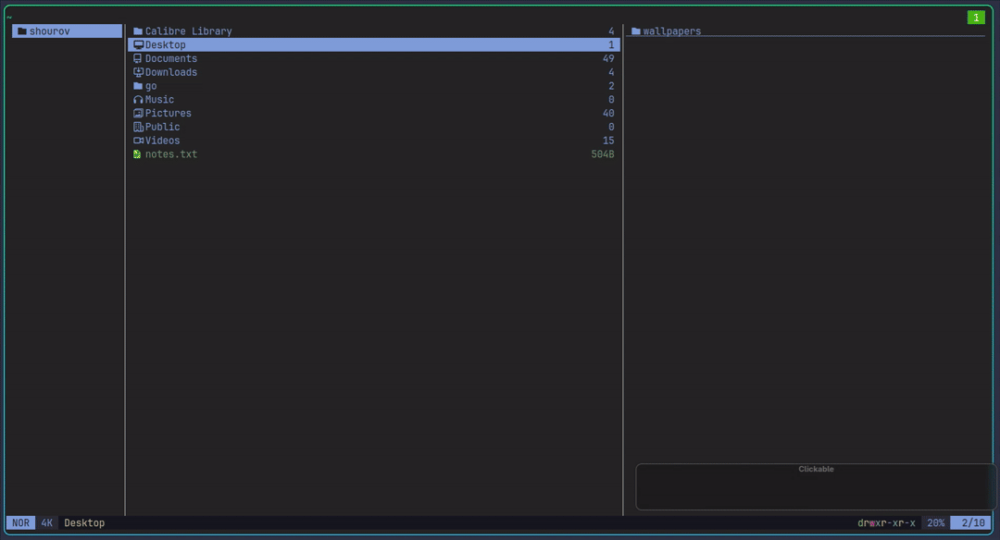

# Thumbnail yazi

Display thumbnails in yazi 

## Demo


## Requirements

- **Yazi >= 26.8.15** — the plugin uses APIs added in that release and does nothing on older versions.
- A gallery viewer for your display server (chosen automatically from `$WAYLAND_DISPLAY`):
  - **Wayland:** [swayimg](https://github.com/artemsen/swayimg) — Wayland-only.
  - **X11:** [nsxiv](https://codeberg.org/nsxiv/nsxiv) — X11-only, opened in thumbnail mode.
- [ffmpegthumbnailer](https://github.com/dirkvdb/ffmpegthumbnailer) (only needed for video files)

## Installation

```sh
ya pkg add tasnimAlam/thumbnail
```

## Usage

Add this to your `~/.config/yazi/keymap.toml`:

```toml
[[mgr.prepend_keymap]]
on   = [ "<C-t>" ]
run  = 'plugin thumbnail'
desc = "Open current directory in the thumbnail gallery"
```

The viewer is picked from `$WAYLAND_DISPLAY`: `swayimg --gallery` on Wayland,
`nsxiv -t` on X11.

On X11, nsxiv decodes images through **imlib2**, so which formats open depends on
your local imlib2 build — not on nsxiv or this plugin. Arch's imlib2, for
example, adds `svg jxl webp heif tiff ico j2k qoi` loaders while other distros
ship fewer. imlib2 has **no AVIF loader**, so AVIF files are skipped on the X11
path; swayimg ships its own loaders and is unaffected.

Video files are included in the gallery as a still frame extracted by
`ffmpegthumbnailer` and cached under `$XDG_CACHE_HOME/thumbnail.yazi`. Neither
swayimg nor nsxiv can play video, so opening a video's tile shows that still
frame, not the video.

## License

This plugin is MIT-licensed. For more information check the [LICENSE](LICENSE) file.
